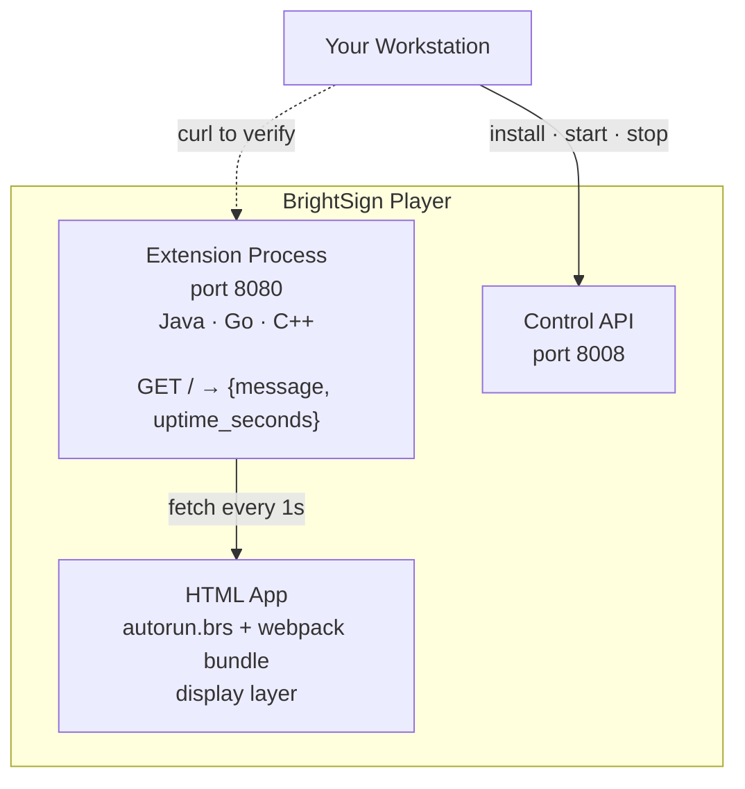

# BrightSign Extension Workshop

A hands-on workshop for development teams building BrightSign player extensions. In
roughly half a day, participants go from a blank workstation to a working extension
running on a live player — and understand the complete workflow they will use on every
extension they build after this.

---

## Workshop Roles

Three roles are referenced throughout this material:

| Abbreviation | Role | Responsibilities |
|---|---|---|
| **WL** | Workshop Leader | Owns and ships the hardware kit (travel router, switch, players). Sets up the room and network. Pre-insecures all player units before the session. Leads the presentation and demo in Module 0. |
| **WF** | Workshop Facilitator | Walks the room during hands-on sections. Answers participant questions, unblocks stuck participants, and keeps the session on pace. May be the same person as the WL in smaller sessions. |
| **WP** | Workshop Participant | The developer doing the hands-on work. Follows each module step-by-step on their own workstation and player. |

---

## What You Will Build

A working BrightSign extension and an HTML app that consumes it, deployed together on a
live player:



The extension itself is intentionally simple — an HTTP server that returns a JSON
greeting and uptime. The point is not the code inside it. The point is the complete,
repeatable workflow: build → package → deploy → verify → iterate. That workflow is
identical whether the extension does computer vision, sensor fusion, or anything else
your team builds.

---

## Workshop Structure

| Module | Topic | Duration |
|---|---|---|
| [00](workshop/00-introduction/README.md) | Introduction | 15 min |
| [01](workshop/01-environment-setup/README.md) | Environment Setup | 30 min |
| [02](workshop/02-understand-template/README.md) | Understand the Template | 20 min |
| [03](workshop/03-player-api/README.md) | The Player API | 15 min |
| — | *Break* | 10 min |
| [04](workshop/04-build/README.md) | Build the Extension | 45 min |
| [05](workshop/05-package/README.md) | Package | 15 min |
| [06](workshop/06-deploy/README.md) | Deploy | 20 min |
| [07](workshop/07-verify/README.md) | Verify | 15 min |
| — | *Break* | 10 min |
| [08](workshop/08-iterate/README.md) | Iterate | 20 min |
| [09](workshop/09-html-app/README.md) | The HTML App | 30 min |
| [10](workshop/10-production/README.md) | Production Hardening | 15 min |
| [Cleanup](workshop/cleanup/README.md) | Cleanup | 5 min |
| **Total** | | **~3.5 hours** |

Module 4 is the only language-specific module. Every other module is identical regardless
of whether the extension is written in Java, Go, C++, or anything else.

---

## Prerequisites

**WP (Workshop Participant) prerequisites**

| Requirement | Notes |
|---|---|
| GitHub account | Personal or work account — you will create your own extension repo from the template and push your work there. Sign up free at https://github.com if you don't have one. |
| Docker or Podman | Docker Desktop (macOS/Windows), Docker Engine, or Podman. Every build tool (JDK, Maven, Node, Go, squashfs-tools) is pre-installed in the workshop container — no other software installation required. |

**Provided by the WL — WPs bring nothing else**

| Item | Purpose |
|---|---|
| BrightSign player (pre-insecured) | Your development target for the session |
| Ethernet cable | Player to switch |
| SD card | Module 9 HTML app deployment |
| Travel router + Ethernet switch | Workshop LAN with internet bridging |

---

## Quick Start

**1. Clone this repo and enter it**

```bash
git clone https://github.com/BrightSign-Playground/bs-extension-workshop
cd bs-extension-workshop
```

**2. Start the dev container** (run from inside the cloned directory)

macOS / Linux — Docker:
```bash
docker run -it --rm \
    -v "$(pwd):/workspace" \
    ghcr.io/brightsign-playground/bs-extension-workshop-devenv:latest
```

macOS / Linux — Podman:
```bash
podman run -it --rm \
    -v "$(pwd):/workspace" \
    ghcr.io/brightsign-playground/bs-extension-workshop-devenv:latest
```

Windows (PowerShell) — Docker:
```powershell
docker run -it --rm `
    -v "${PWD}:/workspace" `
    ghcr.io/brightsign-playground/bs-extension-workshop-devenv:latest
```

Windows (PowerShell) — Podman:
```powershell
podman run -it --rm `
    -v "${PWD}:/workspace" `
    ghcr.io/brightsign-playground/bs-extension-workshop-devenv:latest
```

You are now at `/workspace` inside the container — which is the cloned repo. Work
persists on your host after the container exits.

> **Note:** The Module 4 smoke test (`curl localhost:8080`) runs inside the container and
> does not require publishing port 8080 to your host. If you want to reach the extension
> from your host browser, add `-p 8080:8080` to the run command (or `-p 18080:8080` if
> port 8080 is already in use on your machine).

**3. Start at Module 0**

Open [workshop/00-introduction/README.md](workshop/00-introduction/README.md) and follow
the modules in order.

---

## Companion Repos

| Repo | Purpose |
|---|---|
| [bs-extension-workshop-html-app](https://github.com/BrightSign-Playground/bs-extension-workshop-html-app) | HTML app deployed in Module 9 |
| [extension-template](https://github.com/brightsign/extension-template) | The packaging scaffold every extension uses |
| [brightsign-npu-gaze-extension](https://github.com/brightsign/brightsign-npu-gaze-extension) | Production example of a real extension |

---

## Running the Workshop

If you are a BrightSign facilitator, see the [Facilitator Guide](facilitator-guide/README.md)
for pre-workshop setup, a timing table, common failure modes and fixes, and suggestions
for fast finishers.

---

## Repository Layout

```
workshop/
├── 00-introduction/
├── 01-environment-setup/
├── 02-understand-template/
├── 03-player-api/
├── 04-build/                language-specific module
│   ├── README.md            Java (full), Go + C++ (stubs)
│   └── java/
│       └── hello-extension/ Maven project + bsext_init + Makefile
├── 05-package/
├── 06-deploy/
├── 07-verify/
├── 08-iterate/
├── 09-html-app/
├── 10-production/
└── cleanup/
docker/
└── Dockerfile               dev container published to GHCR
facilitator-guide/
└── README.md
```

---

## License

Apache 2.0 — see [LICENSE](LICENSE).
