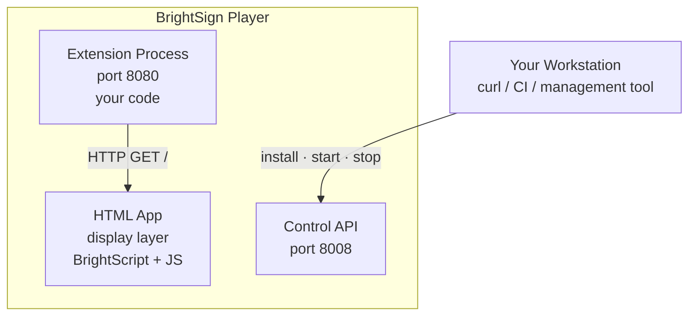
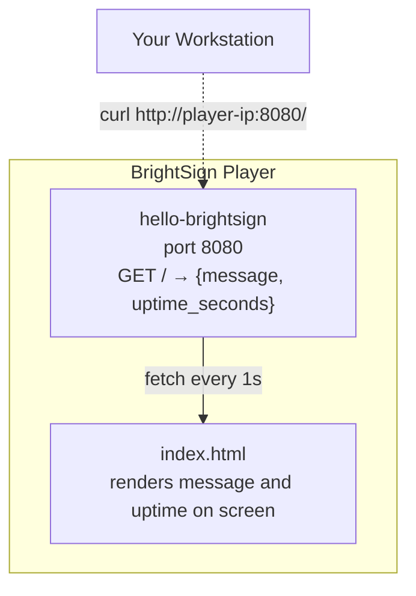

<!-- instructor: demo the finished product on a live player before starting — show curl output and the HTML app on screen. This sets expectations and motivates the steps. -->

# Module 0: Introduction

**Duration:** 15 minutes
**Learning Objectives:**
- Explain what a BrightSign extension is and how it runs on the player
- Describe the three-process architecture: extension, HTML app, and Control API
- Identify what the extension-template provides and why it accelerates development
- State what you will build and deploy by the end of this workshop

**Prerequisites:** None — this is the first module.

---

## 1. What Is a BrightSign Extension?

A BrightSign extension is a **separate process** that runs alongside BrightSign OS on the player. It is not a plugin or a scripting hook — it is a standalone executable that the OS starts and manages.

Key properties:

- Runs as its own process on the player hardware
- Exposes HTTP endpoints on **port 8080** that other processes (and remote clients) can call
- Has full access to hardware, the filesystem, and the network — anything the player supports
- Is **language-agnostic**: Java, Go, C++, or any language that produces a runnable binary

> **Note:** The extension HTTP server runs on port 8080 by convention. BrightSign OS does not enforce this — your extension can bind any available port — but the workshop and the template use 8080 throughout.

---

## 2. Why Teams Build Extensions

| Problem | Extension solution |
|---|---|
| BrightSign OS does not expose a capability natively | Implement it yourself and expose it over HTTP |
| Custom compute needed (AI inference, sensor fusion, proprietary protocols) | Run the compute on the player; no external server required |
| Round-trip latency to a backend server is unacceptable | Co-locate business logic with the display device |

The extension model lets you treat the BrightSign player as a general-purpose Linux compute node that also drives a display.

---

## 3. System Architecture

**How the pieces interact:**

1. You upload a packaged extension to the player via the **Control API (port 8008)**.
2. The Control API installs and starts the extension process.
3. The **extension process** binds port 8080 and begins serving HTTP.
4. The **HTML app** running in the display layer fetches data from `http://localhost:8080` and renders it on screen.

---

## 4. What the Extension Template Gives You

The `extension-template` repository in this workshop provides:

- **Packaging structure** — `manifest.json`, compiled binary, and a ZIP archive in the layout BrightSign OS expects
- **Deploy pipeline** — a scripted sequence: upload → install → start → verify
- **Consistent pattern** — the template works for any language; teams replace the binary with their own without changing the packaging or deploy steps

> **Tip:** The template's core value is the workflow, not the code. Once you understand how packaging and deployment work, swapping in a real extension (AI inference engine, sensor reader, etc.) is a matter of replacing the binary and updating `manifest.json`.

---

## 5. What We Will Build Today

By the end of this workshop you will have deployed a fully functional extension to a live BrightSign player.

**The extension ("Hello BrightSign"):**
- HTTP server on port 8080
- Single endpoint `GET /` returning JSON with server uptime
- Intentionally trivial — the workflow is the point, not the logic

**The HTML app:**
- Polls the extension endpoint every few seconds
- Displays the JSON response on screen

**The full cycle:**
- Package → deploy → verify with `curl` → see output on the display

---

## 6. Architecture of the Finished Product

---

## 7. What This Workshop Is Not

> **Note:** This is not a Java, Go, or C++ tutorial. The extension binary is intentionally trivial — a minimal HTTP server that returns a static JSON response. The purpose of this workshop is to teach the **packaging and deployment workflow**, not application development. Once you know the workflow, the language and complexity of your actual extension are separate concerns.

---

## Next Step

Proceed to **[Module 1: Environment Setup](../01-environment-setup/README.md)** to install the required tools and verify connectivity to your player.
