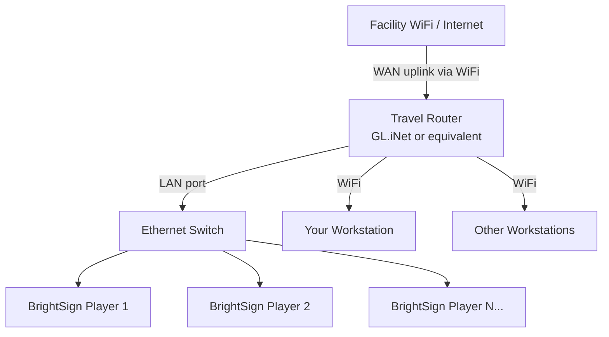

# Module 1: Environment Setup

**Duration:** 30 minutes
**Learning Objectives:**
- Connect your workstation to the workshop network
- Locate your player's IP address and verify connectivity
- Confirm the player is configured for extension development
- Create your own extension repository from the template on GitHub
- Launch the workshop development container

**Prerequisites:** Module 0 complete. Docker Desktop, Docker Engine, or Podman installed. GitHub account (personal or work) — needed in section 1.4.

---

## 1.1 Workshop Network Setup

<!-- instructor: Hand out the SSID and password before this section. Players are already plugged into the switch. Confirm the travel router has a WAN uplink to facility WiFi before participants arrive — if the router cannot reach the venue WiFi, participants won't be able to clone repos from inside the container. -->

The WL provides a travel router that bridges the venue internet connection to a local workshop network. The network topology is:



Your workstation connects to the travel router over **WiFi**. This gives you:
- Access to the internet (for `git clone`, `docker pull`, etc.)
- Direct access to the BrightSign players on the wired LAN

The players connect to the travel router via Ethernet through a switch — not WiFi. This ensures stable, low-latency connections to the players during deployment.

1. On your workstation, connect to the workshop WiFi:
   - **SSID:** provided by your WL
   - **Password:** provided by your WL

2. Confirm your workstation received an IP on the workshop subnet:

   macOS / Linux:
   ```
   ip addr show   # or: ifconfig
   ```
   Windows:
   ```
   > ipconfig
   ```
   Expected: an address in the travel router's subnet (e.g. `192.168.8.x`).

3. Confirm you have internet access:
   ```
   curl -s https://api.github.com | python3 -m json.tool | head -5
   ```
   Expected: JSON from GitHub API. If this fails, ask your WL — the router's WAN uplink may need attention.

---

## 1.2 Find Your Player's IP Address

Each player at your bench has a label showing its IP address. This IP is a static DHCP reservation set up by the WL — it will not change during the workshop.

> **If there is no label on your player**, boot it without an SD card inserted. The player displays its IP address on the connected display during boot.

1. Note the IP address from the label (or from the display).

2. Set an environment variable — this is used in every module from here on:
   ```
   export PLAYER_IP=<your_player_ip>
   ```

   > **Tip:** Save this in a file so it survives a container restart:
   > ```
   > echo "export PLAYER_IP=$PLAYER_IP" >> /workspace/.envrc
   > ```

3. Verify the player is reachable:
   ```
   ping -c 3 $PLAYER_IP
   ```
   Expected:
   ```
   3 packets transmitted, 3 received, 0% packet loss
   ```

4. Verify the BrightSign API responds:
   ```
   curl -s http://$PLAYER_IP/api/v1/info | python3 -m json.tool
   ```
   Expected: JSON with player model, firmware version, serial number.

   > **Note:** The DWS runs on port 80 (not 8008). The WL has already configured the
   > player to run the DWS with no authentication required.

---

## 1.3 Understand the Player's Development Configuration

<!-- instructor: Players have already been insecured and had the development autorun.brs applied. Walk participants through what was done and why. Emphasize that insecuring is irreversible — these are dedicated development units. -->

The WL has already prepared each player for extension development. This section explains what was done so you understand the state of the hardware you are working with.

### What "Insecuring" Means

BrightSign players ship with secure boot enabled. Secure boot prevents unsigned code — including native OS extensions — from running. To develop and deploy unsigned extensions, secure boot must be permanently disabled. This is a one-way, irreversible operation called "insecuring" the player.

> **Warning:** Insecuring a player cannot be undone by factory reset, OS update, or any other means. The players provided for this workshop are dedicated development units. Never insecure a production player.

The insecuring process required:
1. Connecting a serial cable (115200 baud, 8N1) and interrupting the bootloader at startup using the SVC button + Ctrl-C.
2. Running `disable_secure_boot` at the bootloader prompt (or `setenv SECURE_CHECKS 0` + `saveenv` as a fallback).
3. Enabling the BrightScript debugger via `script debug on` at the BrightSign shell.

### What the Development autorun.brs Does

After insecuring, the WL booted each player with this `autorun.brs` on an SD card:

```brightscript
Sub Main()
    regB = CreateObject("roRegistrySection", "brightscript")
    regB.Write("debug", "1")
    regB.Flush()

    reg = CreateObject("roRegistrySection", "networking")
    reg.Write("bbhf", "on")
    reg.Write("dwse", "yes")
    reg.Write("curl_debug", "1")
    reg.Write("prometheus-node-exporter-port", "9100")
    reg.write("ssh", "22")
    reg.write("telnet_log_level", "7")
    reg.Flush()

    CreateObject("roNetworkConfiguration", 0).SetupDWS({port:"80", open:"none"})

    n=CreateObject("roNetworkConfiguration", 0)
    n.SetLoginPassword("none")
    n.Apply()

    ShowMessage("now manually reboot the player...")

    'DeleteFile("autorun.brs")
    sleep(50000)
    'RebootSystem()
End Sub

Sub ShowMessage(msg)
    gaa = GetGlobalAA()
    videoMode = CreateObject("roVideoMode")
    resX = videoMode.GetResX()
    resY = videoMode.GetResY()
    videoMode = invalid
    r = CreateObject("roRectangle", 0, resY/2-resY/64, resX, resY/32)
    twParams = CreateObject("roAssociativeArray")
    twParams.LineCount = 1
    twParams.TextMode = 2
    twParams.Rotation = 0
    twParams.Alignment = 1
    gaa.tw = CreateObject("roTextWidget", r, 1, 2, twParams)
    gaa.tw.PushString(msg)
    gaa.tw.Show()
    print msg
End Sub
```

This one-time setup wrote the following registry keys and then the player was rebooted **without the SD card**. After that reboot, the player has:

| Feature | Value |
|---|---|
| Local DWS | `http://<player_ip>/` — no login required |
| SSH | port 22 — no password required |
| BrightScript debug | enabled |
| curl verbose logging | enabled |

> **Warning:** This configuration has no authentication. It is only safe on the isolated workshop travel router network. Do not expose these players to a corporate or public network.

### Verify the Player is Ready

1. Open a browser on your workstation and navigate to:
   ```
   http://<your_player_ip>/
   ```
   Expected: the BrightSign Diagnostic Web Server (DWS) home page loads with no login prompt.

2. Verify SSH from inside the container:
   ```
   ssh brightsign@$PLAYER_IP
   ```
   No password prompt — the autorun.brs called `SetLoginPassword("none")`. You will see log output from the running autorun. Work through the prompt sequence:
   ```
   ^C                        ← drops to BrightScript debugger
   BrightScript Debugger> ^C ← exits the debugger
   BrightSign> exit          ← drops to Linux root shell (insecured player)
   #                         ← you are root; type exit again to disconnect
   ```

3. Verify the DWS API:
   ```
   curl -s http://$PLAYER_IP/api/v1/info | python3 -m json.tool
   ```
   Expected: JSON response with `model`, `firmwareVersion`, `serialNumber`.

If any of these fail, ask your WL before proceeding.

---

## 1.4 Create Your Extension Repo and Start the Container

<!-- instructor: WPs need a GitHub account for this step. Confirm everyone has one before starting. Walk through the "Use this template" flow on the projector. -->

Rather than cloning the extension template directly, you will create your own repository from it. This gives you a repo you own, can push to, and take home after the workshop.

> **Prerequisite:** You need a GitHub account (personal or work). If you do not have one, create a free account at https://github.com now.

### On GitHub (in your browser)

1. Navigate to the extension template:
   ```
   https://github.com/BrightDevelopers/extension-template
   ```

2. Click the **"Use this template"** button (green, near the top right).

3. Select **"Create a new repository"**.

4. Fill in the form:
   - **Owner:** your GitHub username or organization
   - **Repository name:** choose a name for your extension project (e.g. `my-brightsign-extension`, `acme-player-ext`, or whatever fits your use case)
   - **Visibility:** Public or Private — your choice
   - Leave "Include all branches" unchecked

5. Click **"Create repository"**.

   GitHub creates a new repo in your account with the full template structure already in place.

### Clone your repo and start the container

6. Clone your new repo on your workstation and enter it:

   **macOS / Linux:**
   ```
   git clone https://github.com/<your-username>/<your-repo-name>
   cd <your-repo-name>
   ```

   **Windows (PowerShell or Windows Terminal):**
   ```powershell
   git clone https://github.com/<your-username>/<your-repo-name>
   cd <your-repo-name>
   ```

7. Pull the development container image. This fetches it for the first time or updates it
   to the latest version if you already have an older copy:

   **Docker:**
   ```
   docker pull ghcr.io/brightdevelopers/bs-extension-workshop-devenv:latest
   ```

   **Podman:**
   ```
   podman pull ghcr.io/brightdevelopers/bs-extension-workshop-devenv:latest
   ```

   Expected: the image layers download (or `Status: Image is up to date` if already current).

8. Start the development container from inside the cloned directory. The container mounts
   your current directory as `/workspace` so all your work persists after the container exits.

   **macOS / Linux — Docker:**
   ```
   docker run -it --rm \
       -v "$(pwd):/workspace" \
       -e HOST_UID=$(id -u) \
       -e HOST_GID=$(id -g) \
       ghcr.io/brightdevelopers/bs-extension-workshop-devenv:latest
   ```

   **macOS / Linux — Podman (rootless):**
   ```
   podman run -it --rm \
       -v "$(pwd):/workspace" \
       --userns=keep-id \
       ghcr.io/brightdevelopers/bs-extension-workshop-devenv:latest
   ```

   **Windows (PowerShell) — Docker:**
   ```powershell
   docker run -it --rm `
       -v "${PWD}:/workspace" `
       ghcr.io/brightdevelopers/bs-extension-workshop-devenv:latest
   ```

   **Windows (PowerShell) — Podman:**
   ```powershell
   podman run -it --rm `
       -v "${PWD}:/workspace" `
       ghcr.io/brightdevelopers/bs-extension-workshop-devenv:latest
   ```

   You are now at a shell prompt inside the container at `/workspace`. All subsequent
   commands in this workshop are run here unless stated otherwise.

   > **Note:** Docker and Podman handle file ownership differently. Docker uses the
   > `HOST_UID`/`HOST_GID` flags so the container's entrypoint remaps the internal user.
   > Rootless Podman uses `--userns=keep-id` to map your host UID directly into the
   > container without remapping.

   > **Note for Apple Silicon (M1/M2/M3):** If you see a platform warning, add
   > `--platform linux/amd64` to the run command.

   > **Warning (Windows):** Use PowerShell or Windows Terminal — not `cmd.exe`. The
   > `${PWD}` expansion does not work in `cmd.exe`. Docker Desktop's WSL2 integration
   > handles file ownership automatically — no extra flags needed.

   > **Note:** The Module 4 smoke test (`curl localhost:8080`) runs inside the container
   > and does not require publishing port 8080 to your host. If you want to reach the
   > extension from your host browser, add `-p 8080:8080` to the run command (or
   > `-p 18080:8080` if port 8080 is already in use on your machine).

9. Verify tools are available:
   ```
   java -version && mvn -version && node --version && mksquashfs -version 2>&1 | head -1
   ```
   Expected: version lines for each tool, no errors.

> **Note:** This is your extension repo for the rest of the workshop. You will build your
> Hello BrightSign extension here in Module 4 and push your changes back to GitHub at the
> end of the session. The template files in `examples/` are reference material — Module 2
> walks through them.

> **Tip:** Run all `git` commands (commit, push, pull, branch) in a **separate terminal
> on your host** — not inside the container. The container is for building and deploying.
> Your repo directory on the host and `/workspace` inside the container are the same
> folder, so changes made in either place are immediately visible in both.

---

You now have a connected insecured player, a running development container, and your own extension repo ready at `/workspace`.
Proceed to **[Module 2](../02-understand-template/README.md)**.
