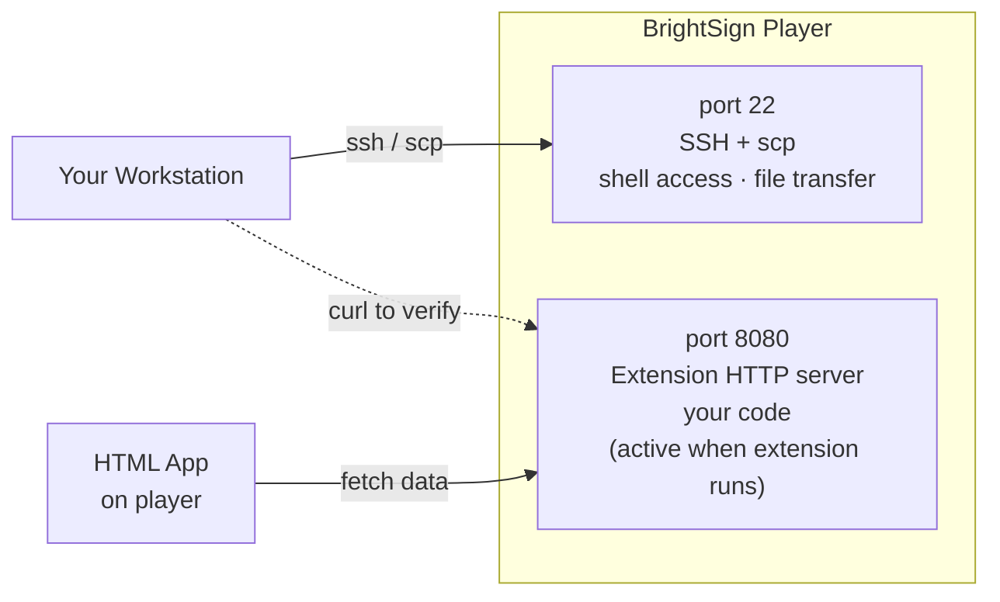

<!-- instructor: run all commands in this module live against your demo player while participants watch. They do not have their own extension yet — this builds the mental model before Module 6. The facilitator demo player should have the finished extension already deployed from pre-session setup. -->

# Module 3: Accessing the Player

**Duration:** 15 minutes

**Learning Objectives:**
- SSH into a BrightSign player from the command line
- Transfer a file to the player using scp
- Run the extension installer and verify the result with curl

**Prerequisites:** Module 2 complete. `PLAYER_IP` environment variable set.

> **Note:** This module is a facilitator-led demo. The facilitator runs every command against the demo player while participants follow along. You will run the same steps yourself with your own extension in Module 6.

---

## 3.1 Two Interfaces

The player exposes two network interfaces you will use throughout the workshop:



Port 22 is how you get in and move files. Port 8080 is how you talk to your extension once it is running.

---

## 3.2 SSH into the Player

1. From your workstation, open an SSH session to the player:

   ```
   $ ssh brightsign@$PLAYER_IP
   ```

   No password is required — the player was configured with `SetLoginPassword("none")` during setup.

   You will see log output from the running autorun. Work through the prompt sequence to reach the Linux shell:

   ```
   ^C         ← Ctrl-C: interrupts the autorun, drops to BrightScript debugger
   BrightScript Debugger> ^C    ← Ctrl-C again: exits the debugger
   BrightSign> exit             ← exit: drops to Linux root shell (insecured players only)
   #                            ← you are now root on the Linux shell
   ```

   Standard BusyBox commands work here: `ls`, `ps`, `cat`, `grep`.

2. Exit the session when done:

   ```
   # exit
   ```

> **Note:** If `ssh` fails with "Connection refused", SSH is not enabled on this player. Ask your facilitator — enabling SSH requires a one-time setup step on the player (covered in the pre-workshop setup guide).

---

## 3.3 Transfer the Extension ZIP

The extension package is a ZIP file produced by the packaging step (Module 5). The player's `/usr/local/` is not directly writable over `scp` — copy to the SD card mount point first:

```
$ scp hello_extension-*.zip brightsign@$PLAYER_IP:/storage/sd/
```

Expected: a progress line that completes without error.

```
hello_extension-1747123456.zip    100%   58MB   4.2MB/s   00:13
```

Once you are at the Linux root shell (section 3.2), unzip directly from the SD card into `/usr/local/`:

```
# cd /usr/local && unzip /storage/sd/hello_extension-*.zip
```

> **Warning:** If `scp` fails with "Connection refused" or "Permission denied", SSH is not enabled or the password is wrong. Resolve this before Module 6 — every deployment step requires SSH access.

---

## 3.4 Install the Extension

1. SSH into the player:

   ```
   $ ssh brightsign@$PLAYER_IP
   ```

2. Change to `/usr/local/`, list the ZIP to confirm the transfer, unzip it, and run the install script:

   ```
   # cd /usr/local
   # ls hello_extension-*.zip
   # unzip hello_extension-TIMESTAMP.zip
   # bash ext_hello_extension_install-lvm.sh
   ```

   Replace `TIMESTAMP` with the actual timestamp in the filename from the `ls` output.

   Expected install output:

   ```
   Verifying checksum... OK
   Creating logical volume hello_extension...
   Writing squashfs image...
   Installation complete. Reboot to activate.
   ```

> **Warning:** If checksum verification prints `FAILED`, the ZIP was corrupted during transfer. Exit, re-run the `scp` command, and retry from the unzip step.

> **Note:** The install script writes a squashfs image to an LVM logical volume on the player's eMMC. At next boot the player mounts it read-only at `/var/volatile/bsext/hello_extension/`. You never edit this script — it is generated by the packaging step.

---

## 3.5 Reboot

```
# reboot
```

Exit the SSH session. Wait 60–90 seconds for the player to complete its boot sequence and initialize the BrightSign runtime. The extension starts automatically once the runtime is ready.

---

## 3.6 Verify

After the player has rebooted, confirm the extension is responding from your workstation:

```
$ curl -s http://$PLAYER_IP:8080/ | python3 -m json.tool
```

Expected output:

```json
{
    "message": "Hello from BrightSign!",
    "uptime_seconds": 12
}
```

The extension is installed, running, and serving HTTP on port 8080.

> **Tip:** The `uptime_seconds` field increments with each second the extension process has been alive. A small value (under 120) confirms the extension started cleanly after this reboot rather than carrying state from a previous run.

---

## 3.7 Key Takeaway

The complete deployment workflow is:

```
scp ZIP to player → ssh in → unzip → bash install-lvm.sh → reboot → curl to verify
```

This sequence is identical for every extension regardless of language. The squashfs packaging and LVM deployment mechanism does not care what runtime is inside the image — Java, Go, C++, or anything else goes through the same steps.

You will run this exact sequence yourself in Module 6 with the extension you build in Module 4.

---

**Next:** [Module 4 — Build the Extension Binary](../04-build/README.md)
