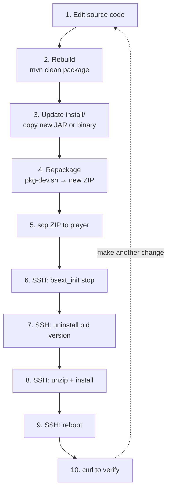

<!-- instructor: this is the most important module for teams taking the workflow home. The deploy loop is what they will run daily. Watch for participants skipping the stop step — it causes the install script to fail. -->

# Module 8: Iterate — Change and Redeploy

**Duration:** 20 minutes

**Learning Objectives:**
- Execute the full change → rebuild → repackage → redeploy cycle
- Know the stop and uninstall steps required before reinstalling

**Prerequisites:** Module 7 complete. Extension running on player.

---

## 8.1 Make a Code Change

Open `src/main/java/com/brightsign/workshop/HelloExtension.java` in your editor (the file is in your development repo at `/workspace`).

In `handleRoot`, change the message string:

From:

```java
String body = "{\"message\":\"Hello from BrightSign!\",\"uptime_seconds\":" + uptimeSeconds + "}";
```

To:

```java
String body = "{\"message\":\"Hello from BrightSign! (v2)\",\"uptime_seconds\":" + uptimeSeconds + "}";
```

Save the file.

> **Tip:** If you finish early: add a `/health` endpoint that returns `{"status":"ok"}`, and add a `request_count` field to the root response that increments on each request.

---

## 8.2 Rebuild

```
make build
```

Expected: no output (`-q` suppresses Maven's progress lines). A non-zero exit code means a compile error — fix it before continuing.

---

## 8.3 Repackage

Produce a new ZIP with the updated JAR:

```
make package
```

The new ZIP will have a later timestamp in its filename. Confirm:

```
ls -lh hello_extension-*.zip
```

---

## 8.4 Stop and Uninstall the Old Extension

> **Warning:** You must stop the running extension and remove the old LVM volume before installing a new version. The install script creates the LVM volume by name. If a volume with that name already exists, the script fails. Do not skip this step.

SSH into the player:

```
ssh admin@$PLAYER_IP
```

Stop the extension process:

```
# /var/volatile/bsext/hello_extension/bsext_init stop
```

Remove the LVM volume:

```
# /usr/local/ext_hello_extension_install-lvm.sh uninstall
```

Expected: the install script confirms the volume was removed. You can now log out or leave the session open for the next step.

> **Note:** The install script accepts an `uninstall` argument that reverses the installation: it unmounts the squashfs volume and removes the LVM logical volume. The `bsext_init stop` call before uninstall is required because the volume cannot be removed while it is mounted.

---

## 8.5 Copy and Reinstall

From your workstation, transfer the new ZIP:

```
scp hello_extension-*.zip admin@$PLAYER_IP:/usr/local/
```

On the player, unzip and install:

```
# cd /usr/local
# unzip hello_extension-NEWTIMESTAMP.zip
# bash ext_hello_extension_install-lvm.sh
```

Replace `NEWTIMESTAMP` with the timestamp in the new ZIP filename.

Expected install output:

```
Verifying checksum... OK
Creating logical volume hello_extension...
Writing squashfs image...
Installation complete. Reboot to activate.
```

Reboot:

```
# reboot
```

Wait 60–90 seconds.

---

## 8.6 Verify the Change

After reboot:

```
curl -s http://$PLAYER_IP:8080/ | python3 -m json.tool
```

Expected:

```json
{
    "message": "Hello from BrightSign! (v2)",
    "uptime_seconds": 12
}
```

The updated message confirms the new squashfs image is mounted and running.

---

## 8.7 The Deploy Loop

This is the complete cycle for every change. Write it down. Steps 5–10 are identical regardless of language or framework.



> **Note:** Steps 2–4 change per language: Go uses `go build`, C++ uses `make`, and so on. Steps 5–10 are the same for every extension. The squashfs packaging and LVM deployment mechanism does not care what runtime is inside the image.

---

**Workshop complete.** If you are continuing to the production module, see [Module 10 — Production Considerations](../10-production/README.md).
