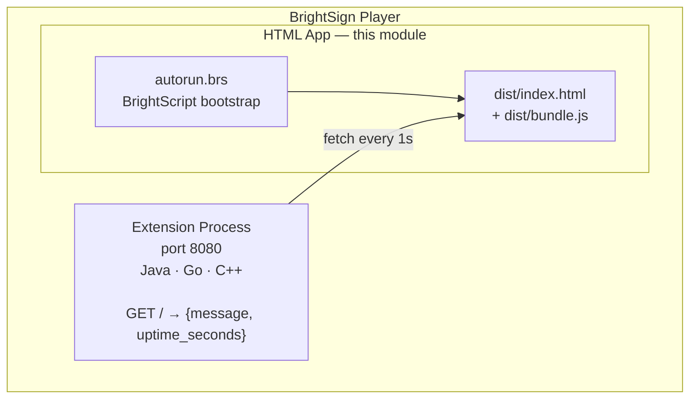

<!-- instructor: clone the bs-workshop-html-app repo before this module. Have the finished app running on your demo player to show the target state. Note: webpack on Windows has known issues — have a pre-built sd/ directory on USB as fallback. -->

# Module 9: The HTML App

**Duration:** 30 minutes
**Learning Objectives:**
- Build a BrightSign HTML application that communicates with the extension
- Understand how autorun.brs bootstraps the HTML layer
- Deploy the HTML app via SD card

**Prerequisites:** Module 8 complete. Extension running on player. Node 14.x available (pre-installed in the workshop container).

---

## 9.1 How the HTML App Fits In

The extension you built in earlier modules exposes an HTTP API on port 8080. The HTML app is a separate piece of content that runs alongside the extension on the same player. It polls that API and renders the result on screen.

Updated architecture:



The HTML app lives in its own repository, separate from the extension repo.

---

## 9.2 Clone the HTML App

```
cd /workspace
git clone https://github.com/BrightSign-Playground/bs-extension-workshop-html-app
cd bs-extension-workshop-html-app
```

Verify contents:
```
ls
```
Expected: `src/`, `package.json`, `webpack.config.js`, `Makefile`, `README.md`

---

## 9.3 Project Structure

```
find . -type f | sort
```

Expected output:

```
./Makefile
./package.json
./webpack.config.js
./src/autorun.brs
./src/index.html
./src/index.js
```

Walk each file:

- `autorun.brs`: BrightScript entry point. Creates a message port, creates an HTML widget, loads `dist/index.html` from the SD card, enables SSH and inspector.
- `src/index.html`: Minimal HTML shell. Loads `bundle.js` and calls `window.main()`.
- `src/index.js`: The fetch loop — polls `localhost:8080` every second, updates DOM elements.
- `webpack.config.js`: `target: node`, externalizes `@brightsign/*` packages.
- `Makefile`: `prep` / `build` / `publish` / `clean` targets.

> **Note:** `target: node` in `webpack.config.js` is correct and intentional. BrightSign's JavaScript runtime is Node-compatible, not a browser. This setting allows use of Node APIs and correctly externalizes BrightSign platform packages that are provided by the runtime, not bundled.

---

## 9.4 Walk src/index.js

The core polling loop (read through this — do not type it):

```javascript
const EXTENSION_URL = 'http://localhost:8080/';
const POLL_INTERVAL_MS = 1000;

async function poll() {
  try {
    const response = await fetch(EXTENSION_URL);
    const data = await response.json();
    document.getElementById('message').textContent = data.message;
    document.getElementById('uptime').textContent = `Uptime: ${data.uptime_seconds}s`;
  } catch (e) {
    document.getElementById('message').textContent = 'Extension not responding';
  }
}

window.main = function() {
  setInterval(poll, POLL_INTERVAL_MS);
  poll();
};
```

> **Note:** `fetch` is available in the BrightSign JS runtime. No polyfill needed.

`window.main` is the entry point called by `index.html` after the page loads. Starting the interval there — rather than at module load time — ensures the DOM is ready before the first poll fires.

---

## 9.5 Walk src/autorun.brs

The BrightScript bootstrap structure:

```brightscript
Sub Main()
  msgPort = CreateObject("roMessagePort")
  html = CreateObject("roHtmlWidget", ...)
  html.LoadURL("file:///sd:/dist/index.html")
  ' event loop
  While True
    msg = Wait(0, msgPort)
  End While
End Sub
```

> **Note:** `autorun.brs` is the entry point for ALL BrightSign content — not just HTML apps. The player runs this file automatically when it boots with an SD card present. The `roHtmlWidget` object launches the Chromium-based renderer and loads the specified URL into it.

The `Wait(0, msgPort)` call blocks indefinitely, keeping the BrightScript process alive and the HTML widget running.

---

## 9.6 Build

**Step 1 — Install dependencies:**

```
make prep
```

Expected output: npm install completes without errors.

**Step 2 — Build the bundle:**

```
make build
```

Expected output: webpack produces `dist/bundle.js` and copies `dist/index.html`.

**Step 3 — Verify the output:**

```
ls dist/
```

Expected output:

```
bundle.js  index.html
```

> **Warning:** If webpack exits with an error about `Cannot find module`, run `make prep` again. A missing `node_modules` directory is the most common cause.

---

## 9.7 Publish to SD

```
make publish
```

Expected output: creates `sd/` directory with the following layout:

```
sd/
├── autorun.brs
└── dist/
    ├── bundle.js
    └── index.html
```

The `publish` target copies `autorun.brs` to the SD root and places the built assets under `sd/dist/`. This mirrors the path that `autorun.brs` loads: `file:///sd:/dist/index.html`.

---

## 9.8 Deploy to SD Card

1. Insert the SD card into your workstation.

2. Copy `sd/` contents to the SD card root:

   ```
   cp -r sd/* /media/$USER/BRIGHTSIGN/
   ```

   > **Note:** The mount path varies by OS. On macOS it is typically `/Volumes/BRIGHTSIGN`. Use your file manager to confirm the correct mount point.

3. Eject the SD card safely before removing it:

   ```
   sync && sudo eject /media/$USER/BRIGHTSIGN
   ```

4. Insert the SD card into the player's SD slot.

5. Reboot the player.

> **Note:** The player runs `autorun.brs` from the SD card root on boot. If both an SD card and internal storage contain `autorun.brs`, the SD card takes priority.

---

## 9.9 Verify the HTML App

After the player reboots, the display should show the message and uptime returned by the extension.

**Step 1 — Confirm the extension is responding:**

```
curl -s http://$PLAYER_IP:8080/ | python3 -m json.tool
```

Expected output:

```json
{
    "message": "Hello from BrightSign Extension",
    "uptime_seconds": 42
}
```

**Step 2 — Watch the display.**

The uptime counter on screen should increment every second. If the display shows `Extension not responding`, the extension process is not running — check Module 7 to redeploy it.

> **Tip:** Open the BrightSign inspector in a browser at `http://$PLAYER_IP:2999` to debug JavaScript errors in the HTML app. The console tab shows output from `console.log` calls and any uncaught exceptions.

---

**Next:** [Module 10 — Production Considerations](../10-production/README.md)
